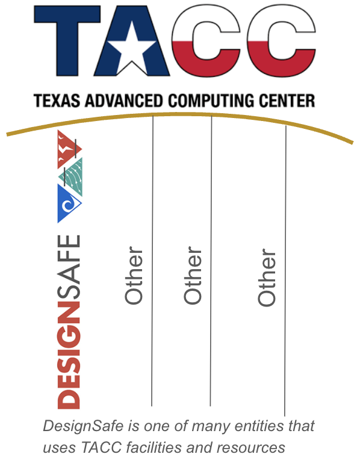

# CHEER Hub DesignSafe Sign-Up Procedures

Prepared by: Caroline Williams

Updated by: N/A

Last Update: April 11, 2024

kf* Manager: Caroline Williams (cjw@udel.edu)

***

## 1. 	DesignSafe Background

[DesignSafe](https://www.designsafe-ci.org/) is a web portal that supports natural hazards research and is hosted by the [Texas Advanced Computing Center](https://tacc.utexas.edu/) (TACC). While “DesignSafe” and “TACC” are sometimes used interchangeably, DesignSafe is just one of many research entities that utilize TACC computers. TACC has many high-performance computers of which DesignSafe primarily uses two, named “Corral” (for data storage) and “Frontera” (for computing). 
 

DesignSafe has two main resources: 1) the [Data Depot](https://www.designsafe-ci.org/data/browser/public/) for data storage and publication, and 2) modeling [tools and applications](https://www.designsafe-ci.org/rw/workspace/#!/), such as Jupyter Notebook and MATLAB software, as well as [SimCenter tools](https://simcenter.designsafe-ci.org/research-tools/overview/). ***Of the two, it’s critical that you understand the workings of the Data Depot*** as this will be the primary place for data storage and data publication for CHEER.

## 2. 	Create a TACC account
All CHEER researchers must set up their own TACC account which will provide access to DesignSafe resources. If you’ve signed up for DesignSafe before, then this means you already have a TACC account. To do so:
1. Request a user account using this website: [https://www.designsafe-ci.org/account/register/](https://www.designsafe-ci.org/account/register/)
	a. If you’re unsure whether you already have a TACC account (perhaps you’ve used DesignSafe before), click “Log in” on the right side and test or reset a password.
2. Follow the instructions provided in the email you receive
3. Go to DesignSafe website: [https://www.designsafe-ci.org/](https://www.designsafe-ci.org/)
4. Press “Log in” in the upper right corner of the DesignSafe website
5. Enter your TACC username and TACC password
If you’re having problems, you can try:
1. Reviewing the [DesignSafe user guide](https://www.designsafe-ci.org/user-guide/), which provides some troubleshooting such as the “Authentication Failed” error.
2. Submitting a [help ticket](https://www.designsafe-ci.org/help/new-ticket/). This will submit a ticket to TACC personnel who can help you set up your account.

## 3. 	Share TACC username with CHEER kf* manager
After setting up your TACC account, please email your TACC username to the kf* manager (see email in header of this doc). ***Do not*** email your TACC password.

## 4. 	Join the DesignSafe Slack Channel
The DesignSafe Slack channel is useful because it provides live TACC server updates, can provide help with DesignSafe questions quickly (often quicker than submitting a help ticket), and supports a community of natural hazards researchers.
All CHEER researchers are strongly encouraged to join the DesignSafe slack channel. To join, follow these steps:
1. Submit a [help ticket](https://www.designsafe-ci.org/help/new-ticket/) to request access to the DesignSafe Slack channel. Be sure to use the same email address that you used to create your TACC account.
2. Wait for about one day, as you will be manually added to the DesignSafe Slack team.
3. Follow the Slack invite instructions that will be sent to your email 
4. For more information, see this webpage: [https://www.designsafe-ci.org/community/slack-online-collaboration/](https://www.designsafe-ci.org/community/slack-online-collaboration/) 

## 5. 	Next steps
Now that your TACC account has been set up, you’re likely interested in either uploading data to DesignSafe or developing code. To do so, follow the instructions provided in the following guides:
- CHEER Hub Top Ten Data Tips
- [CHEER Hub DesignSafe Data Upload Procedures](05b-CHEER_DesignSafe_DataUpload)
- CHEER Hub Code Templates

