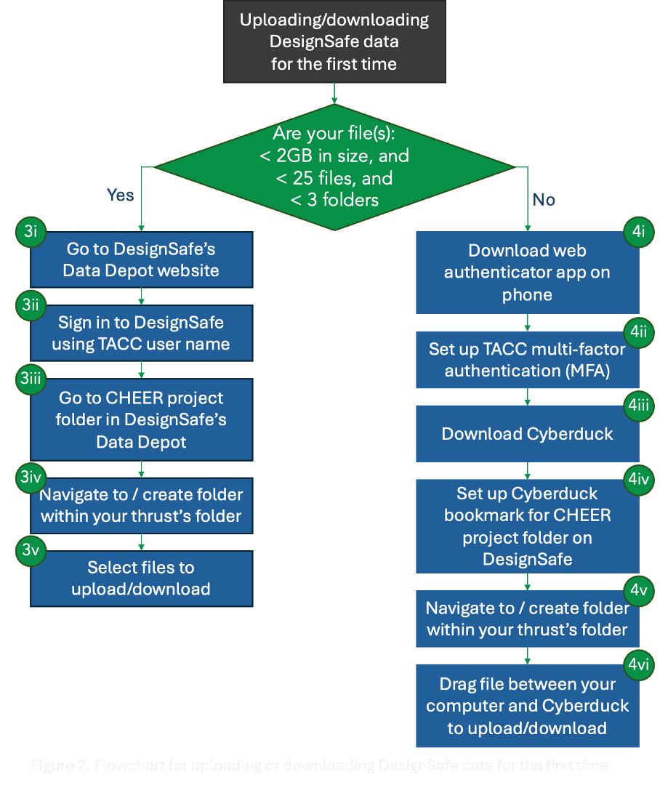
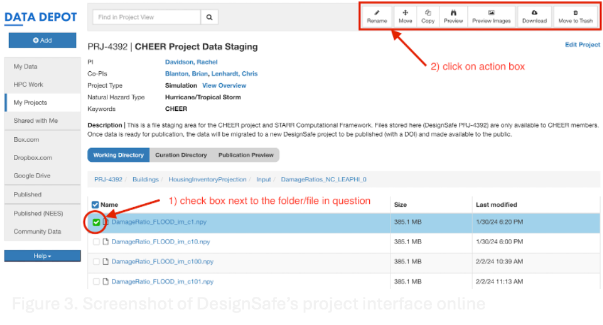

# CHEER Hub DesignSafe Data Upload

Prepared by: Caroline Williams

Updated by: N/A

Last Update: April 11, 2024

kf* Manager: Caroline Williams (cjw@udel.edu)

***

## 1. 	Background

CHEER primarily uses the [Data Depot](https://www.designsafe-ci.org/data/browser/public/) on DesignSafe to store and publish data. While DesignSafe has a [comprehensive guide](https://www.designsafe-ci.org/user-guide/managingdata/) for managing and publishing data on the DesignSafe Data Depot, the following is intended to provide streamlined steps to upload data on the CHEER project in DesignSafe.

There are three main places where a DesignSafe user can access and store data on DesignSafe: 
* **My Data**: personal storage location only accessible to you
* **My Projects**: shared storage locations (“Projects”) that are only accessible to designated team members
* **Published**: published data open to the public

The [CHEER project folder](https://www.designsafe-ci.org/data/browser/projects/1798100155562136046-242ac117-0001-012/) is a private location to store data that can only be shared among CHEER team members. Only CHEER team members have access to this project folder. 
Once a dataset is ready to be published for public use, the data will be moved from the CHEER project folder (PRJ-4392) to a new project on the DesignSafe Data Depot (PRJ-<new number>). This new project will then be published and receive a DOI. See the CHEER Hub Data Publishing Procedure doc when you’re ready to publish data.

***
**IMPORTANT:** Identifying Sensitive Data

Before uploading any data to DesignSafe, you *must consult with your advisor* to determine whether your data are sensitive data or not. Sensitive data includes, but is not limited to:
* **Proprietary data**
  * Examples: insurance claims data, Zillow/ZTRAX data, satellite or street view images, non-public parcel data
  * Generally, anything requiring a Data Use Agreement or a private key to access the data is sensitive data
* **Personally identifiable information (PII)**
  * Examples: names, social security numbers, license/passport numbers, anything that can pinpoint an individual
* **Institutional Review Board (IRB)**
  * Any sensitive content identified in an IRB document including PII, interview recordings, other sensitive research data
* **Other**: HIPPA, FERPA, ITAR, CUI, EAR, or anything else listed on [TACC’s protected data service](https://tacc.utexas.edu/about/security-and-compliance/protected-data-service/)

***

## 2. 	Uploading data to the CHEER project folder

Depending on the number and size of files/folders that you need to transfer to the CHEER project folder, there are primarily two different ways to upload the data: 1) normal data transfer method, or 2) large data transfer method. Figure 1 (next page) summarizes these steps, with detailed instructions below.

  

1) First identify whether you are in possession of sensitive data (see box above). 
	a) If you do have sensitive data, send an email to the kf* manager to decide how to proceed as a team. One possibility that the team may pursue is to work with [TACC’s Protected Data Service team](https://tacc.utexas.edu/about/security-and-compliance/protected-data-service/).
	b) If you do not have sensitive data, proceed with the following steps.

2. Review the CHEER Hub’s Top Ten Data Tips to ensure your data aligns with the CHEER recommendations
3. If you are transferring files that are < 2GB in size, or < 25 files or < 3 folders, you can follow the normal data transfer method:
  a. Go to the [DesignSafe website](https://www.designsafe-ci.org/)
  b. Sign in using your TACC user name
  c. Go to CHEER project folder in Data Depot
    i. Go to the “Use DesignSafe” tab, then click “Data Depot”
    ii. Click “My Projects” on the left panel
    iii. Click on the CHEER project folder (PRJ-4392)
      1. Note: If you do not see PRJ-4392, email the kf* manager with your TACC user name to make sure they added you to the CHEER project folder
  d. Navigate to the folder corresponding to your project. 
    i. Click on the thrust folder related to your project (Buildings, Economy, Government, Hazards, Households)
      1. Note: If you would like to create a new folder here, please contact the kf* manager first.
    ii. If you need to add a new folder for your project, click the “Add” button in the left panel and create a new folder. When naming the folder, you must adhere to the following:
      1. The name must not have spaces. Use capitalization or underscores to separate words (e.g., HousingInventoryProjection, housing_inventory_projection)
      2. Make the folder name concise yet descriptive (i.e. avoid unfamiliar arbitrary acronyms or generic descriptions)
      3. Thrust teams should discuss how they want to organize their folder
  e. To upload files, click on the “Add” button on the left panel and select “File upload: max 2GB”
    i. Choose your file and press “Begin upload”
    ii. To rename, move, copy, download, or delete a folder or file, you must check the box next to the file/folder, then click on the appropriate action in the top panel (below the search bar)
  f. For help with transferring files on the Data Depot, submit a [help ticket](https://www.designsafe-ci.org/help/new-ticket/)

4. If you are transferring files that are > 2GB in size, or > 25 files or > 3 folders, you need to follow the large data transfer method:
  a. If you do not have an authentication app on your phone (e.g., [Google Authenticator](https://apps.apple.com/us/app/google-authenticator/id388497605), [Microsoft Authenticator](https://apps.apple.com/us/app/microsoft-authenticator/id983156458), [Duo](https://apps.apple.com/us/app/duo-mobile/id422663827)), download the app of your choice.
    i. Note: it’s possible that you already have an authenticator app on your phone for your university’s multi-factor authentication (MFA), for GitHub, or other needs. You can use this same app in the following steps.
  b. Set up multi-factor authentication on TACC (see [TACC guide](https://docs.tacc.utexas.edu/basics/mfa/) for details):
    i. Go to the [TACC portal (https://tacc.utexas.edu/)](https://tacc.utexas.edu/portal/login) (*this is a different website than the DesignSafe homepage*)
    ii. Sign in using your TACC username and password
    iii. Click on your username in the upper right corner
    iv. Click on “Manage Account”
    v. Click on “Pair Device”
    vi. Select “Token App”
    vii. Click on the gray square to generate a QR code
    viii. Open your authenticator app on your phone and select the option to pair an account/token (likely represented by a “+” sign in the upper right corner of your phone screen)
    ix. The app will launch your phone’s camera and you will need to scan the QR code.
    x. Your device is now paired. Every time you are asked for a TACC token, you will need to open this app on your phone and enter the code associated with TACC.
    xi. For help, submit a [help ticket](https://www.designsafe-ci.org/help/new-ticket/)
  c. Next, you’ll need to download Cyberduck to your computer, which is a software that will transfer files from your computer to DesignSafe (known as an SSH file transfer protocol (SFTP) client).
    i. [Download Cyberduck](https://cyberduck.io/download/) on your computer
      1. Note: you may download/use a different SFTP client (e.g., WinSCP, Fetch, Globus) if you prefer.
      2. Note: Cyberduck may prompt you to make a donation, but this is unnecessary and you can ignore
  d. Set up bookmark in Cyberduck
    i. Open Cyberduck
    ii. Select “Bookmark” from the top bar, then select “New Bookmark” from the dropdown.
    iii. Add the following information to the bookmark screen:
      1. Select “SFTP (SSH file transfer protocol)” from dropdown of options
      2. Nickname: corral
      3. URL: [ignore - this will auto-populate as you enter info in other boxes] 
      4. Server: data.tacc.utexas.edu
      5. Username: {your TACC username}
      6. Anonymous login: [ignore]
      7. Password: {your TACC password}
      8. SSH private key: None
      9. Client certificate: None
      10. Select “more options” to reveal eight more bookmark settings
      11. Path: /corral/projects/NHERI/projects/1798100155562136046-242ac117-0001-012/
        a. Note: the long number in this path identifies the CHEER project folder on DesignSafe. See [this guide](https://www.designsafe-ci.org/user-guide/managingdata/#setting-path-to-ds-on-corral) for more information about DesignSafe file paths.
      12. Web URL: [ignore]
      13. Download folder: [select folder that you’d like files to be downloaded to on your local computer]
      14. Transfer files: Default
      15. Timezone: UTC
      16. Encoding: UTF-8
      17. Connect mode: Default
      18. Then close bookmark box
    iv. Select the “corral” bookmark
    v. Enter your six-digit TACC token (accessible through your authenticator app on your phone)
    vi. You now have access to the CHEER project folder on DesignSafe. The file structure you see here should be the same as the [CHEER project folder available on the DesignSafe web interface](https://www.designsafe-ci.org/data/browser/projects/1798100155562136046-242ac117-0001-012/).
  e. Click on the thrust folder related to your project (Buildings, Economy, Government, Hazards, Households)
    i. Note: If you would like to create a new folder here, please contact the kf* manager first.
    ii. Navigate to the folder corresponding to your project within your thrust’s folder. 
      1. If you need to add a new folder for your project, click on “File” > “New Folder” 
      2. When naming the folder, you must adhere to the following:
        a. The name must not have spaces. Use capitalization or underscores to separate words (e.g., HousingInventoryProjection, housing_inventory_projection)
        b. Make the folder name concise yet descriptive (i.e. avoid unfamiliar arbitrary acronyms or generic descriptions)
        c. Thrust teams should discuss how they want to organize their folder
  f. Drag files from your computer into the Cyberduck interface which will initiate the file transfer. (You can also drag files from Cyberduck to your computer, which would initiate a file download.)
    i. When you’re adding and moving files in Cyberduck, you will frequently be asked to add a TACC token. Therefore, it’s best to have your phone nearby and your authenticator app open when you’re transferring many files.
  g. For help with transferring files on Cyberduck, submit a [help ticket](https://www.designsafe-ci.org/help/new-ticket/)

## 3. File naming standards
While everyone should review the CHEER Top Ten Data Tips, the following summarizes the requirements for CHEER file naming.
* MOST IMPORTANT: do not use spaces in file names
* Underscores or capitalization are your friend (e.g., REACH_module_outputs, REACHmoduleOutputs)
* Don’t use special characters (& ,* % # ;*( !@$^~' { [?<-)
* Don’t depend on letter case alone to distinguish between files
  * Ex. Don’t use BldgInv_v1.csv and bldginv_v1.csv as two different file names
* When many versions of a file will exist, lead the file name with the date: YYYY-MM-DD_<fileName>
  * Ex. 2024-01-26_<fileName>
* Make file name meaningful and descriptive (i.e., “a24_temp_draft.csv” is not meaningful)
* For the main part of file name (e.g., <fileName> in example below) lead with most general description and end with more specific description
  * Ex. 2024-01-26_CHEER_BldgInv_RoofShapeImputation_Gable.csv
* When using sequential numbering, use leading zeros
  * Ex. “001”, not “1”
* Only use a period before the file extension
* Limit file names to 32 characters or less.

## 4. Next Steps
Now you’re likely interested in developing your code or using DesignSafe HPC resources. To do so, follow the instructions provided in the following guides:
* CHEER Hub Code Templates
* CHEER Hub GitHub Procedures
* CHEER Hub DesignSafe HPC Usage Procedures

