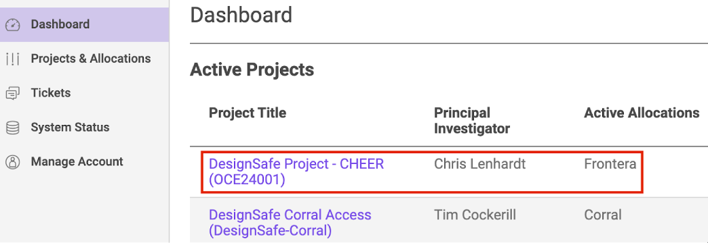
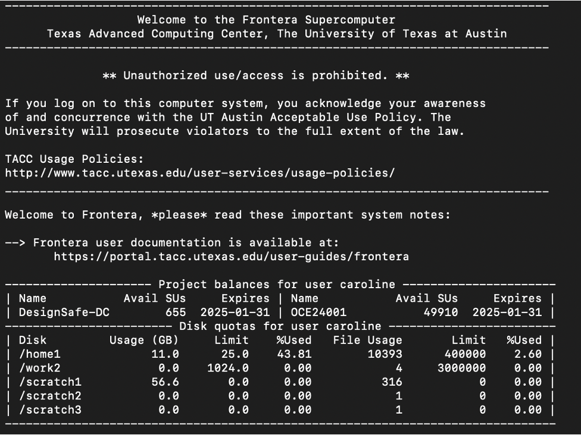

# CHEER Hub DesignSafe HPC Usage Procedures

Prepared by: Caroline Williams

Updated by: N/A

Last Update: April 22, 2024

kf* Manager: Caroline Williams (cjw@udel.edu)

***

## 1. 	Background

High performance computing (HPC) is the ability to process data and perform complex calculations at high speeds. TACC has [multiple computers](https://tacc.utexas.edu/systems/all/), including Frontera and Corral. While Corral is used to store data (see the [CHEER Hub DesignSafe Data Upload Procedures](05b-CHEER_DesignSafe_DataUpload)), Frontera is used to perform your HPC tasks. Frontera is the fastest academic supercomputer in the world and is managed through a [Slurm system](https://slurm.schedmd.com/overview.html). The Slurm manages computing tasks run on Frontera based on the task’s required computing resources and priority level. You run your code on Frontera by running a “batch script.” The batch script sets your needed computing resources, your computing environment, and the script to run. Follow the procedures below to use Frontera or refer to [Frontera documentation](https://docs.tacc.utexas.edu/hpc/frontera/) provided by TACC>

***

## 2. 	Using Frontera
<ol>
<li>If you haven’t already signed up for a TACC account sign, follow the [CHEER DesignSafe Sign-Up Procedures](05a-CHEER_DesignSafe_SignUp.md)</li>
<li>Upload your input datafiles on the CHEER DesignSafe project folder (refer to [DesignSafe Data Upload Procedures](05b-CHEER_DesignSafe_DataUpload))</li>
<li>If you haven’t downloaded cyberduck and set up the TACC multi-factor authentication on your authenticator app on your phone, go back to the [DesignSafe Data Upload Procedures](05b-CHEER_DesignSafe_DataUpload) doc and complete these steps.</li>
<li>Make sure you’ve been added to the CHEER DesignSafe HPC allocation</li>
  <ol>
  <li>Go to [https://tacc.utexas.edu/](https://tacc.utexas.edu/) </li>
  <li>Click “Log in” in the top right</li>
  <li>Use your TACC username and password to sign in </li>
  <li>On your dashboard, make sure you see “DesignSafe Project - CHEER (OCE24001)” under the “Active Projects” section</li>
    
  

  
  

    <ol>
    <li>If you don’t see this project listed on your TACC dashboard, email the kf* manager and ask them to add your TACC username to the CHEER DesignSafe allocation</li>
    </ol>
  </ol>
<li>Open SSH client (differs for Windows and Mac)</li>
  <ol>
  <li>For Windows:</li>
    <ol>
    <li>Download [PuTTY](https://www.chiark.greenend.org.uk/~sgtatham/putty/latest.html) (an SSH client for windows)</li>
    <li>Follow PuTTY installation instructions</li>
    <li>Double click on PuTTY icon to open </li>
    <li>In the PuTTY Configuration window make sure the Connection type is SSH</li>
    <li>Enter “frontera.tacc.utexas.edu” for Host Name</li>
    <li>Click “Open”</li>
    <li>Answer “Yes” to the SSH security question</li>
    <li>In the PuTTY terminal, enter your TACC username after the “login as:” prompt, then press enter</li>
    <li>Enter the password associated with your TACC account, then press enter</li>
    <li>Open your authenticator app on your phone, then enter your 6-digit TACC token value, then press enter</li>
    </ol>
  <li>For Mac:</li>
    <ol>
    <li>Search for “Terminal” on your Mac and open</li>
    <li>Type “ssh <TACC_username>@frontera.tacc.utexas.edu” (replacing <TACC_username> with your TACC username), then press enter</li>
    <li>Enter the password associated with your TACC account, then press enter</li>
    <li>Open your authenticator app on your phone, then enter your 6-digit TACC token value, then press enter</li>
    </ol>
  <li>You should now see something like this in your SSH client:</li>

  

  
  

  </ol>
<li>Become familiar with the file directory in Frontera</li>
  <ol>
  <li><b>Home directory</b>: the home directory will only hold minimal files, including your batch script, code, and perhaps a few key output files that you don’t want deleted. The home directory has <b>limited storage space</b>, therefore you should be judicious about what’s stored here.</li>
    <ol>
    <li>Type “pwd” to identify the file path of your home directory on Frontera</li>
    <li>Take note of this path, which should look something like “/home1/<5-digit_TACC_ID_number>/<your_TACC_username>”</li>
      <ol>
      <li>You will need the 5-digit TACC ID number</li>
      </ol>
    <li>In this home directory, create a new folder (aka “directory”) for your project by typing “mkdir <name_of_project>” (replacing <name_of_project> with the name of your project), then press enter</li>
      <ol>
      <li>Note: the name of this folder cannot have spaces</li>
      </ol>
    <li>Type “ls”, then enter, to see a list of the folders now in your home directory</li>
    <li>To go into the folder you just created, type “cd <name_of_project”, then enter</li>
    <li>To go back to your home directory, type “cd ..”, then enter</li>
    <li>For additional information, see these [command line tips](https://gist.github.com/bradtraversy/cc180de0edee05075a6139e42d5f28ce)</li>
    </ol>
  <li><b>Scratch file</b>: your scratch file on Frontera has unlimited storage, but, files are <b>subject to deletion after 10 days</b>. Therefore, the scratch system should only be used to save intermediate or temporary files.</li>
    <ol>
    <li>Your scratch file path is /scratch1/<5-digit_TACC_ID_number>/<your_TACC_username></li>
    <li>Go to your scratch file by typing: “cd /scratch1/<5-digit_TACC_ID_number>/<your_TACC_username>”, press enter</li>
    <li>Add any folders you may want to store temporary output files</li>
    </ol>
  <li><b>Corral files</b>: As a reminder, the CHEER DesignSafe data is stored on TACC’s “Corral” computer, however HPC activities are conducted on TACC’s “Frontera” computer.</li>
    <ol>
    <li>Take note of CHEER DesignSafe project folder path: /corral/projects/NHERI/projects/1798100155562136046-242ac117-0001-012</li>
    <li>To access published DesignSafe projects, the path will be: /corral/projects/NHERI/projects/PRJ-<XXXX> (replace “<XXXX>” with the DesignSafe project number)</li>
    <li>You cannot access DesignSafe “My Data” files from Frontera</li>
    <li>For more on DesignSafe file paths, see this [DesignSafe guide](https://www.designsafe-ci.org/user-guide/managingdata/#setting-path-to-ds-on-corral)</li>
    </ol>
  <li><b>File path summary</b>:</li>
    <ol>
    <li>Frontera home directory: /home1/<5-digit_TACC_ID_number>/<your_TACC_username></li>
    <li>Frontera scratch directory: /scratch1/<5-digit_TACC_ID_number>/<your_TACC_username></li>
    <li>CHEER DesignSafe project directory: /corral/projects/NHERI/projects/1798100155562136046-242ac117-0001-012</li>
    <li>DesignSafe published projects directory: /corral/projects/NHERI/projects/PRJ-<XXXX></li>
    </ol>
  </ol>
<li>Review the script(s) for your project</li>
  <ol>
  <li>If writing your script in python, use the CHEER python templates</li>
  <li>Be sure that your code follows these CHEER documentation standards</li>
  </ol>
<li>Load virtual environments to your profile</li>
  <ol>
  <li>For python:</li>
    <ol>
    <li>Use Python virtualenv instead of Conda</li>
      <ol>
      <li>In the terminal, type “cd ~”, press enter</li>
      <li>Type “mkdir python-env”, press enter</li>
      <li>Type “cd python-env”, press enter</li>
      <li>Type “virtualenv cuda10-home”, press enter</li>
      <li>To activate the environment, type “source ~/python-env/cuda10-home/bin/activate”, press enter</li>
      <li>To deactivate, type “deactivate”</li>
      <ol/>
    </ol>
  <li>Loading other modules</li>
    <ol>
    <li>To view additional modules and available versions loaded on Frontera, type“module spider”, press enter</li>
    <li>To load modules you want, either:</li>
      <ol>
      <li>Type “module load” to load all modules</li>
      <li>Or type “module load <module name>/<module version>“ to load certain modules</li>
      </ol>
    </ol>
  <li>For more information about setting the environment, see the [Frontera documentation](https://docs.tacc.utexas.edu/hpc/frontera/#admin-configuring-modules)</li>
  </ol>
<li>Create batch script (these batch scripts are used to prioritize jobs run on Frontera)</li>
  <ol>
  <li>Download CHEER batch script template</li>
    <ol>
    <li>Note: Other batch scripts are available in the [Frontera documentation](https://docs.tacc.utexas.edu/hpc/frontera/#admin-configuring-modules)</li>
    </ol>
  <li>Set computing needs through the following settings (note that each node has 56 processors):</li>
    <ol>
    <li>--nodes=<number of tasks needed, divided by 56, and rounded up to integer></li>
    <li>--ntasks=<number of tasks / iterations in simulated needed></li>
    <li>--job-name=<your choice; make descriptive job name></li>
    <li>--mail-user=<your email address></li>
    <li>-e <name of error file>%j.txt</li>
    <li>-o <name of output file>%j.txt</li>
    <li>--time=D-HH:MM:SS (max allowable is 2 days: 1-23:59:59)</li>
    </ol>
  <li>Load required environment</li>
    <ol>
    <li>If using python, load python virtual environment </li>
    <li>Ex: source ~/python-env/cuda10-home/bin/activate</li>
    <li>Load other modules</li>
    <li>Ex. module load</li>
    </ol>
  <li>Use ibrun to run code</li>
    <ol>
    <li>Ex. ibrun python3 mhip.py</li>
    </ol>
  <li>Save batch script file as document (not plain text, or other file format). You can use nearly any file extension</li>
  </ol>
<li>Submit batch job</li>
  <ol>
  <li>Once you’re on Frontera, in the terminal type “sbatch <name of batch script> and press enter</li>
  </ol>
<li>Monitor job</li>
  <ol>
  <li>Type “squeue -u <TACC username>”, then enter, to view the status of the jobs you’ve been running and how long they’ve been running</li>
  <li>Note the assigned job number </li>
  </ol>
<li>Cancel job</li>
  <ol>
  <li>Copy the job number after monitoring the job using squeue</li>
  <li>Type “scancel <job number>”, then enter</li>
  </ol>
<li>Getting help:</li>
  <ol>
  <li>There are many other ways to configure jobs on Frontera. For more information, review the [TACC Frontera documentation](https://docs.tacc.utexas.edu/hpc/frontera/#admin-configuring-modules).</li>
  <li>For specific help, submit a question on the DesignSafe slack channel (faster) or submit a [help ticket](https://www.designsafe-ci.org/help/new-ticket/) (slower).</li>
  </ol>
</ol>

***

## 3. Next Steps
Now you’re likely interested in developing your code or using DesignSafe HPC resources. To do so, follow the instructions provided in the following guides:
* CHEER Hub GitHub Procedures
* CHEER Hub Metadata Template
* CHEER Hub Data Publishing Checklist

