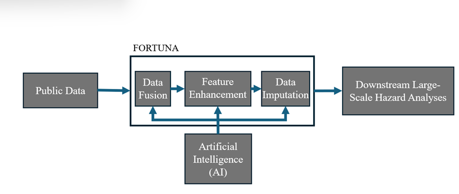

# Building Inventory Generator: FORTUNA

Prepared by Hesam Soleimani (soleimanisam92@g.ucla.edu)

Updated by: Hesam Soleimani

Satatus: Functioning with ungoing updates planned

Last Update: October 1, 2025

# Contents
- [Overview](#overview)
- [Data Fusion](#d-fusion)
- [Imputation](#imputation)
- [Feature Enhancement](#feature_enhance)
- [Version Control](#version-c)

# Overview of STARR

The objective of **FORTUNA** (Framework for LaRge-Scale Infrastructure InvenTory Generation for Urban Natural Hazard Analysis), available at https://github.com/CHEER-Hub/Fortuna is to automate the process of building inventory generation for large-scale hazard assessment and simulation studies.

The FORTUNA framework is structured as illustrated in the following image.

<figure>
  
  <figcaption> Figure 1. FORTUNA Overview.</figcaption>
</figure>

# Version Control

The table below tracks the FORTUNA versions.

| Version        | Main Feature(s)                           | Key Purpose                                         | Resources |
|----------------|--------------------------------------------|-----------------------------------------------------|-----------|
| **FORTUNA V0** | Performs Data Fusion, only | Performs Data Fusion Across [FEMA](https://fema.maps.arcgis.com/home/item.html?id=0ec8512ad21e4bb987d7e848d14e7e24&sublayer=0), [NSI](https://www.hec.usace.army.mil/confluence/nsi/), and [Microsoft US Building](https://github.com/microsoft/USBuildingFootprints) databases | [Python code](https://github.com/CHEER-Hub/Fortuna) · [Documentation](https://hesam-92-19.github.io/Some_Documentations) |
---
